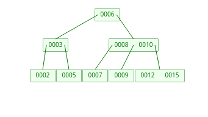

# Final 04-07-2024

## 1) Escriba en pseudocódigo (o en C si le parece mas fácil) una implementación de las operaciones de inserción y eliminación de un heap binario. Explique cómo funcionan. Justifique en base a estas implementaciones la complejidad de las operaciones.

```
estructura heap
    vector //Arreglo de enteros
    tamaño //Tamaño del heap
    cantidad //Cantidad de elementos

procedimiento swap(A, i, j)
    temp = A[i]
    A[i] = A[j]
    A[j] = temp
fin

procedimiento siftup(A, i)
    si i es 0
        retorna
    
    padre = (i - 1) / 2

    si A[padre] < A[i]
        swap(A, i, (i - 1) / 2)
        siftup(A, (i - 1) / 2)
fin

procedimiento insertar(A, i)
    si A.cantidad = A.capacidad
        retorna

    A.vector[A.cantidad] = i
    siftup(A.vector, A.cantidad)
    A.cantidad += 1
fin

procemiento siftdown(A, i, j)
    izq = (i * 2) + 1
    der = (i * 2) + 2
    
    si i <= j
        retorna

    mayor = i

    si izq < j y A[izq] > A[mayor]
        mayor = izq

    si der < j y A[der] > A[mayor]
        mayor = der

    si mayor != i
        swap(A, i, mayor)
        siftdown(A, mayor, j)
fin

procemiento eliminar(A)
    si A.cantidad = 0
        retorna null

    eliminado = A.vector[0]
    A.cantidad -= 1
    A.vector[0] = A.vector[A.cantidad]
    siftdown(A, 0, A.cantidad)

    retorna eliminado
fin 
```

### Complejidades:
* siftup -> realiza a lo sumo log n intercambios.
* insertar -> como el heap es un árbol binario completo, su altura es O(log n).
* siftdown -> en el peor caso, el nodo baja O(log n) niveles.
* eliminar -> como el heap es un árbol binario completo, su altura es O(log n).

## 2) Explicar (con diagramas) qué es un Árbol B, sus propiedades y los diferentes casos que se pueden dar durante la inserción y eliminación. Insertar en un Árbol B con 3 claves por nodo los siguientes elementos en secuencia: [6,8,3,2,5,9,7,12,15,10].

* Es una estructura de datos de arbol balanceado (es como el Arbol Binario de Busqueda) pero con la particularidad que puede tener mas de dos hijos por nodo. Por lo que esta balanceado y es optimo al momento de busqueda, inserccion y eliminacion.
* Cada nodo va a tener "K" claves y "K + 1" hijos como maximo. Cada nodo (excepto la raiz) para ser valido tendra que tener como minimo "K / 2" claves.

### Casos:
    1. Insertar (sin overflow): el nodo tiene espacio para insertar la clave.
    2. Insertar (con overflow): el nodo se lleno y requiere hacer una division. Se agrega la clave y se toma la clave del medio para promoverla un nivel y se acomodan las uniones.
    3 Eliminar (sin underflow): el nodo tiene suficientes claves inclusive despues de elimianr.
    4. Eliminar (con underflow - redistribucion): el nodo se queda sin claves suficientes. Se fija si algun nodo tiene alguna clave de mas y se sube esa y se baja la clave del padre.
    5. Eliminacion (con underflow - concatenacion): el nodo  se queda sin valves suficientes. Ningun hermano tiene suficientess claves. Por lo que se fusionan con el hermano y se baja una clave del padre.


<div align="center">

</div>

## 3) Explique para qué sirve y cómo funcionan el algoritmo de Dijkstra. Muestre cómo se aplica paso a paso al siguiente grafo desde C.

* Dijkstra es un algoritmo el cual nos permite encontrar la ruta mas corta desde un nodo origen al resto de los nodos de un grafo con peso (sin pesos negativos).

### Pasos:
    1. Elige vertice inicial
    2. Listas nodos visitados y no visitados. Una tabla con 3 columnas (vertices, distancia minima, nodo anterior).
    3. Se toma el primer vertice y se calcula la distancia que es 0 y las demas distancias a los demas vertices como "infinito".
    4. Se visita el nodo no visitado con menor distancia conocida desde el nodo visitado.
    5. Se calcula la distancia sumando las distancias de cada uno.
    6. Si la distancia es menor a la que ya estaba se actualiza.
    7. Se agrega el nodo a los visitados.
    8. Se sigue con el nodo de menor distancia.

<div align="center">

</div>

## 4)Escriba una función (en C) que reciba un vector (de tamaño arbitrario) de strings y devuelva el primer string repetido del vector. La función debe poder funcionar en tiempo lineal respecto de la cantidad de strings. Explique la solución y justifique por qué es lineal.

```c
char *primer_repetido(char **vector, size_t tamanio) {
    hash_t *hash = hash_crear(3);
    if (!hash)
        return NULL;
    
    for (size_t i = 0; i < tamanio; i++) {
        void *encontrado = NULL;

        if (!hash_insertar(hash, vector[i], (void *)1, &encontrado)) {
            hash_destruir(hash, NULL);
            return NULL;
        }

        if (encontrado) {
            hash_destruir(hash, NULL);
            return vector[i];
        }
    }

    hash_destruir(hash, NULL);
    return NULL;
}
```

* La implementación usa una tabla de hash abierta para almacenar las cadenas y detectar la primera repetición. La función hash_insertar maneja colisiones y retorna `NULL` si la clave no estaba antes en la tabla o el valor previo si la clave ya existia. La operacion de hash_insertar va a ser generalmente O(1) (en caso que no todas las claves se colisionen).

## 5) Explique qué es un diccionario y cuáles son sus principales características. Haga una comparativa entre diccionarios implementados con tablas de hash y con árboles autobalanceados. Escriba dos fragmentos de código (en C) donde se evidencie la conveniencia de una implementación por sobre la otra.

Un diccionario es un tipo de dato que almacena pares clave-valor.  

Las principales características de un diccionario son:  
- Los costos de inserción, eliminación y búsqueda son O(1) en el caso promedio. En el peor caso, los costos pueden ser O(n).  
- No permite claves repetidas. Si una clave ya existe, se reemplaza el valor asociado.  

Comparación entre diccionarios implementados con tablas de hash y con árboles autobalanceados:  

Tablas de hash:  
- Ventajas:  
  - Costo de inserción, eliminación y búsqueda O(1) en el caso promedio.  
  - Implementación más sencilla.  
- Desventajas:  
  - En el peor caso, los costos pueden ser O(n).  
  - No permiten recorrer los elementos en orden.  

Árboles autobalanceados:  
- Ventajas:  
  - Costo de inserción, eliminación y búsqueda O(log n).  
  - Permiten recorrer los elementos en orden.  
- Desventajas:  
  - Implementación más compleja.  
  - En el caso promedio, los costos son O(log n).  

```c
typedef struct {
    char *tabla[100];
} hashcerrado;

unsigned int func_hash(char *clave) {
    unsigned int hash = 0;
    for (size_t i = 0; clave[i]; i++)
        hash = 31 * hash + clave[i];
    return hash % 100;
}

void insertar_hash(hashcerrado *hash, const char *clave) {
    unsigned int pos = func_hash(clave);

    while (hash->tabla[pos] != NULL) {
        if (++pos == 100) pos = 0;
    }

    hash->tabla[pos] = calloc(strlen(clave) + 1, sizeof(char));
    if (!hash->tabla[pos]) return;
    strcpy(hash->tabla[pos], clave);

    return;
}
```

```c
typedef struct {
    char *clave;
    struct avl *izq, *der;
} avl;

avl *insertar_avl(avl *raiz, const char *clave) {
    if (raiz == NULL) {
        avl *nuevo = malloc(sizeof(avl));
        if (!nuevo) return NULL;
        nuevo->clave = strdup(clave);
        nuevo->izq = nuevo->der = NULL;
        return nuevo;
    }

    if (strcmp(clave, raiz->clave) < 0)
        raiz->izq = insertar_avl(raiz->izq, clave);
    else
        raiz->der = insertar_avl(raiz->der, clave);

    return raiz;
}
```
