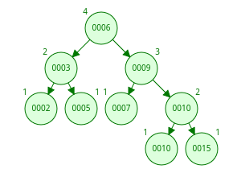

# Final 11-07-2024

## 1) Explique utilizando un fragmento de código cuál es la forma correcta de utilizar realloc para agrandar un bloque de memoria. Explique por qué es la forma correcta y cuáles son los riesgos de no hacerlo de esa forma. Dibuje un diagrama que muestre el problema.

```c
int main() {
    int *v = malloc(sizeof(int) * 10);
    if (!v) {
        printf("Error al alocar memoria");
        return 1;
    }

    for (int i = 0; i < 10; i++)
        v[i] = i * 2;

    int *temp = realloc(v, sizeof(int) * 20);
    if (!temp) {
        printf("Error al realocar memoria");
        free(v);
        return 1;
    }

    v = temp;

    for (int i = 0; i < 10; i++)
        v[i] = i * 2;

    for (int i = 0; i < 20; i++) 
        printf("%d  ", v[i]);

    free(v);
    return 0;
}
```

* La funcion `realloc` puede fallar. Si este falla, sale del programa y libera lo anterior. Si se hubiera hecho `v = realloc(v, sizeof(int) * 20)` si se asignara el resultado de realloc directamente al puntero original y fallara se perderia la referencia al bloque original generando perdida de memoria.

## 2) Explicar (con diagramas) qué es un Árbol AVL, sus propiedades y los diferentes casos que se pueden dar durante la inserción y eliminación. Insertar en un AVL los siguientes elementos en secuencia: [6,10,5,2,3,7,9,10,15]. Mostrar el estado del árbol luego de cada inserción.

* Es una estructura de datos de arbol balanceado (es como el Arbol Binario de Busqueda) pero con la particularidad que se autobalancea solo al momento de insertar o eliminar un nodo.
* Cada nodo tendra un factor de balanceo el cual se calcula haciendo la altura izquierda del subarbol del nodo `-` la altura derecha del subarbol del nodo si este numero es -1, 0 o 1 esta bien, caso contrario esta desbalanceado y corresponde balancear.

### Casos:
    1. Rotacion simple derecha: ocurre cuando se inserta un nodo en el subarbol izquierdo del hijo izquierdo.
    2. Rotacion simple izquierda: ocurre cuando se inserta un nodo en el subarbol derecho del hijo derecho.
    3. Rotacion doble izquierda-derecha: ocurre cuando se inserta un nodo en el subarbol derecho del hijo izquierdo.
    4. Rotacion doble derecha-izquierda: ocurre cuando se inserta un nodo en el subarbol izquierdo del hijo derecho.

<div align="center">

</div>

## 3) Explique para qué sirve y cómo funcionan el algoritmo de Dijkstra. Muestre cómo se aplica paso a paso al siguiente grafo desde A.

* Dijkstra es un algoritmo el cual nos permite encontrar la ruta mas corta desde un nodo origen al resto de los nodos de un grafo con peso (sin pesos negativos).

### Pasos:
    1. Elige vertice inicial
    2. Listas nodos visitados y no visitados. Una tabla con 3 columnas (vertices, distancia minima, nodo anterior).
    3. Se toma el primer vertice y se calcula la distancia que es 0 y las demas distancias a los demas vertices como "infinito".
    4. Se visita el nodo no visitado con menor distancia conocida desde el nodo visitado.
    5. Se calcula la distancia sumando las distancias de cada uno.
    6. Si la distancia es menor a la que ya estaba se actualiza.
    7. Se agrega el nodo a los visitados.
    8. Se sigue con el nodo de menor distancia.

<div align="center">

</div>

## 4) Escriba (en C) las estructuras y operaciones necesarias para definir un TDA Grafo. La implementación de dicho TDA debe incluír el uso de diccionarios. Haga uno o mas diagramas mostrando cómo funciona la implementación. Explique cada una de las operaciones y sus complejidades. Implemente solamente las funciones de inserción y eliminación de aristas.

```c
#ifndef GRAFO_H
#define GRAFO_H

#include <stdlib.h>
#include <stdbool.h>

typedef struct nodoLista {
    int destino;
    struct nodoLista *siguiente;
} nodoLista;

typedef struct vertice {
    int id;
    nodoLista *adyacentes;
    struct vertice *siguiente;
} vertice;

typedef struct grafo {
    vertice *listaVertices;
} grafo;

// Inicializa un grafo vacio. Si pudo lo devuelve, caso contrario NULL
grafo *grafo_crear();

// Busca el vertice dado. Recibe el grafo y el id. Si lo encuentra lo devuelve, caso contrario NULL
vertice *vertice_buscar(grafo *, int);

// Inserta un vertice. Recibe el grafo y el id. Si pudo devuelve True, caso contrario False
bool vertice_insertar(grafo *, int);

// Elimina un vertice, Recibe el grafo y el id. Si pudo devuelve ek vertice, caso contrario NULL
vertice *vertice_eliminar(grafo *, int);

// Inserta una arista. Recibe el grafo, el id de origen y el de destino. Si pudo devuelve True, caso contrario False.
bool arista_insertar(grafo *, int, int);

// Elimina una arista, Recibe el grrafo, el id de origen y el de destino. Si pudo eliminar devuelve la arista, caso contrario NULL
nodoLista *arista_eliminar(grafo *, int, int);

// Muestra el grafo. Recibe el grafo.
void grafo_mostrar(grafo *);

// Libera la memoria del grafo
void grafo_destruir(grafo *, void(*destructor)(void *));
```

```c
#include "grafo.h"
#include "hash.h"

bool arista_insertar(grafo *g, int origen, int destino) {
    if (!g || !hash_contiene(g->listaVertices, (char[12]){0}) || !hash_contiene(g->listaVertices, (char[12]){0})) {
        return false; // Alguno de los vértices no existe
    }

    // Buscar el vértice de origen
    vertice *v_origen = hash_buscar(g->listaVertices, (char[12]){0});
    if (!v_origen) return false;

    // Crear nueva arista
    nodoLista *nueva_arista = malloc(sizeof(nodoLista));
    if (!nueva_arista) return false;

    nueva_arista->destino = destino;
    nueva_arista->siguiente = v_origen->adyacentes; // Insertar al inicio
    v_origen->adyacentes = nueva_arista;

    return true;
}

nodoLista *arista_eliminar(grafo *g, int origen, int destino) {
    if (!g || !hash_contiene(g->listaVertices, (char[12]){0})) {
        return NULL; // El vértice de origen no existe
    }

    // Buscar el vértice de origen
    vertice *v_origen = hash_buscar(g->listaVertices, (char[12]){0});
    if (!v_origen) return NULL;

    // Buscar la arista en la lista de adyacencia
    nodoLista *actual = v_origen->adyacentes, *anterior = NULL;
    while (actual) {
        if (actual->destino == destino) {
            if (anterior) {
                anterior->siguiente = actual->siguiente;
            } else {
                v_origen->adyacentes = actual->siguiente;
            }
            return actual; // Se devuelve el nodo eliminado
        }
        anterior = actual;
        actual = actual->siguiente;
    }

    return NULL; // No se encontró la arista
}
```

## 5) Explique la diferencia entre un diccionario y una tabla de hash. Explique también la función que cumple la función de hashing y qué características se buscan en la misma. De un buen y un mal ejemplo y justifique. Elabore diagramas donde lo crea necesario para que la explicación sea mas clara

* Diccionario: es una estructura de datos abstracta que almacena pares clave-valor. Las operaciones que se pueden realizar son inserccion, bsuqueda y eliminacion. Pueden ser implementados de muchas formas, como: Arboles balanceados, tabla de hash, listas enlazadas, etc.

* Tabla de hash: es una implementación eficiente de un diccionario que usa una función de hash para mapear claves a posiciones en un arreglo. Contiene un vector para los elementos, la funcion de hash que se encarga de convertir la clave en un indice del vector y un mecanismo de colisiones.

* Funcion de hash: es la clave para que una tabla de hash funcione correctamente. Su objetivo es transformar una clave en un número entero que representa un índice en la tabla. Para que sea una buena funcion de hashing debe cumplir:
    - Distribución uniforme: Las claves deben dispersarse de manera equilibrada en la tabla.
    - Minimización de colisiones: Reduce la cantidad de claves que se asignan a la misma posición.
    - Eficiencia computacional: Debe ser rápida de calcular.
    - Determinismo: Una misma clave siempre debe dar el mismo índice.

```c
// Buena funcion

unsigned int hash_func(const char *clave, size_t capacidad) {
    unsigned int hash = 0;
    while (*clave) {
        hash = (hash * 31) + (*clave++);
    }
    return hash % capacidad;
}

// Mala funcion
unsigned int hash_func(const char *clave, size_t capacidad) {
    return clave[0] % capacidad;
}
```