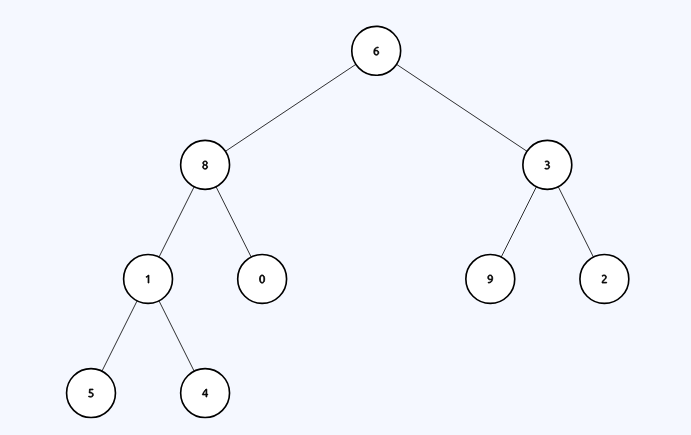
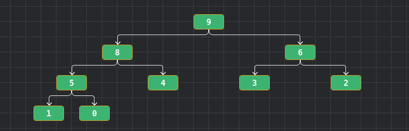

# Final 18-07-2024

## 1) El algoritmo Babilónico para el cálculo de la raíz cuadrada de x consiste en seleccionar una estimación inicial de la raíz a calcular (ej: e=x/2 ) y luego iterativamente verificar si la diferencia entre e*e y el numero original difieren a lo sumo un valor máximo PRECISION. En cada iteración se vuelve a calcular una nueva estimación de la forma nueva_e=(e+x/e)/2. Implemente este algoritmo en C99 sin utilizar do, while, for, etc.

```c
double babilonico_r(double x, double r) {
    double nueva_r = 0.5 * (x / r + r);

    if ((r - nueva_r) < PRECISION && (nueva_r - r) < PRECISION)
        return nueva_r;

    return babilonico_r(x, nueva_r);
}

double raiz(double x) {
    if (x < 0)
        return -1;

    return babilonico_r(x, x / 2);  
}
```

## 2) Explique (con diagramas) cómo funciona heapsort. Muestre paso a paso cómo aplicar el algoritmo de heapsort al siguiente vector de forma in-place V=[6,8,3,1,0,9,2,5,4]. El vector debe quedar ordenado de mayor a menor.

* Es un método de ordenación basado en el uso de un heap (estructura de datos en forma de árbol binario completo donde cada nodo padre es mayor o menor). Tiene dos partes la primera es `Heapify` que transforma el vector en un heap ya sea minimal o maximal y posterior a eso pasa la `extraccion` de la raiz del heap y `reubicacion` de este al final del vector y el ultimo a la raiz y aplicar el siftdown.

<div align="center">

</div>

* Al usar `heapsort` de un `heap maximal`, el orden de los elementos quedaran de menor a mayor y si es un `heap minimal` el vector quedara de mayor a menor.

<div align="center">

</div>

* Al tener el vector ordenado como un heap, quedaria reemplazar el 1 elemento con el ultimo elemento. Una vez hecho el intercambio sacamos uno de la cantidad y aplicamos siftdown

<div align="center">

</div>

## 3) Explique para qué sirve y cómo funcionan el algoritmo de Dijkstra. Muestre cómo se aplica paso a paso al siguiente grafo desde G.

* Dijkstra es un algoritmo el cual nos permite encontrar la ruta mas corta desde un nodo origen al resto de los nodos de un grafo con peso (sin pesos negativos).

### Pasos:
    1. Elige vertice inicial
    2. Listas nodos visitados y no visitados. Una tabla con 3 columnas (vertices, distancia minima, nodo anterior).
    3. Se toma el primer vertice y se calcula la distancia que es 0 y las demas distancias a los demas vertices como "infinito".
    4. Se visita el nodo no visitado con menor distancia conocida desde el nodo visitado.
    5. Se calcula la distancia sumando las distancias de cada uno.
    6. Si la distancia es menor a la que ya estaba se actualiza.
    7. Se agrega el nodo a los visitados.
    8. Se sigue con el nodo de menor distancia.

<div align="center">

</div>

## 4) Explique qué es un recorrido BFS. Suponga que tiene a disposición un TDA Grafo. Explique cómo está implementado este grafo (explique la estructura) e indique qué operaciones necesitaría tener implementadas para poder implementar fácilmente un recorrido BFS. Implemente el algoritmo BFS (suponga que las operaciones de manejo de memoria no fallan nunca). Puede utilizar los TDAS implementados en la materia si los necesita.

* Es un algoritmo de recorrido de grafos que explora todos los nodos a una misma distancia antes de avanzar a los nodos de la siguiente capa.


```c
typedef struct grafo {
    lista_t **adyacencia;
    size_t cantidad_vertices;
} grafo_t;

grafo_t *grafo_crear(size_t cant_vertices) {
    grafo_t *g = malloc(sizeof(grafo_t));

    g->cantidad = cant_vertices;
    g->adyacencia = malloc(sizeof(lista_t) * cant_vertices);

    for (int i = 0; i < cant_vertices; i++)
        g->adyacencia[i] = lista_crear();

    return g;
}

void grafo_agregar_arista(grafo_t *g, int origen, int destino) {
    if (origen >= g->cantidad_vertices || destino >= g->cantidad_vertices)
        return;

    lista_agregar_final(g->adyacencia[origen], (void *)destino);
    lista_agregar_final(g->adyacencia[destino], (void *)origen);
}

lista_t *grafo_vecino(grafo_t *g, int vertice) {
    if (vertice >= g->cantidad_vertices)
        return NULL;

    return g->adyacencia[vertice];
}

void bfs(grafo_t *g, int inicio) {
    cola_t *c = cola_crear();

    bool *visitados = calloc(g->cantidad_vertices, sizeof(bool));

    cola_encolar(c, (void *)inicio);
    visitados[inicio] = true;

    while (!cola_esta_vacia(c)) {
        int actual = (int)cola_desencolar(c);
        printf("Visitado: %d\n", actual);

        lista_t *vecinos = grafo_vecino(g, actual);
        nodoL_t *nodo = vecinos->primer;

        while (nodo) {
            int vecino = (int)nodo->dato;
            if (!visitado[vecino]) {
                visitado[vecino] = true;
                cola_encolar(c, (void *)vecino)
            }
            nodo = nodo->siguiente;
        }
    }

    free(visitado);
    cola_destruir(c);
}
```

## 5) Explique qué es una tabla de hash cerrada. Explique por qué y en qué casos en este tipo de tablas la eliminación de elementos puede llegar a afectar al resto de las operaciones. Ejemplifique con diagramas y explique alguna posible solución al problema.

* Es un tipo de tabla hash en la que los elementos se almacenan directamente en el arreglo que forma la tabla, en lugar de usar estructuras externas como listas enlazadas (hashing abierto).
    - Cada celda de la tabla almacena directamente un elemento (o queda vacía si no hay ninguno).
    - Si hay colisión, se busca la siguiente posición disponible dentro de la tabla usando un método de resolución de colisiones.

* El problema surge cuando insertamos una clave y esa posicion ya esta usada. A traves del metodo de implementado buscara la siguiente posicion libre. Generando una cadena de posiciones que podria estar esa clave. Al eliminar una clave del medio estariamos dividiendo esa cadena y perdiendo la parte posterior ya que significaria que no pudo ser insertada despues del espacio en blanco.

### Posibles soluciones:
    - Poner un flag al dato que marque que fue eliminado entonces a la hora de recorrer para encontrar una clave no se corta la busqueda si hay un `eliminado`.
    - Rehashear todos los elementos de nuevo al eliminar una clave.