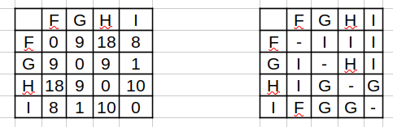

# Final 25-07-2024

## 1) Explique qué es el Teorema Maestro, sus condiciones de aplicación, para qué se utiliza y de un ejemplo de uso. Explique por qué el Teorema no puede aplicarse al algoritmo QuickSort directamente y muestre bajo qué condiciones sí puede aplicarse (y cuál es el resultado de hacerlo).

* Teorema Maestro: es un funcion la cual nos permite calcular la complejidad algoritmica de una funcion de tipo divide y conquista.

* Formula:  `T(n) = a T(n/b) + O(n^c)`
    - a: numero de subproblemas en los que se divide el problema.
    - b: factor de reducción del tamaño del problema en cada nivel de recursión.
    - O(n^c): costo del trabajo adicional fuera de la recursión (como combinar resultados).

### Casos predominantes:
    - logB(A) < C -> T(n) = O(n^c)
    - logB(A) = C -> T(n) = O(n^c * logB(n)) = O(n^c * log(n))
    - logB(A) > C -> T(n) = O(n^logB(A))

### Ejemplos:
    - Mergesort: la ecuancion de recurrencia seria T(n) = 2 T(n/2) + O(n). log2(2) = 1 => T(n) = O(n^c * log(n)) = O(n * log(n))

    - Quicksort: no divide el problema de forma exacta y predecible, sino que su división depende del pivote.
        - Si el pivote divide el arreglo en dos partes iguales => T(n) = 2 T(n/2) + O(n) = O(n * log(n))
        - Si el pivote no divide el arreglo en dos partes iguales no se puede aplicar el Teorema Maestro por lo que la ecuacion de recurrencia => T(n)=T(n−1)+O(n) = O(n^2)

## 2) Explique qué es un árbol Rojo/Negro y enumere las propiedades que debe cumplir. Justifique si cada uno de los siguientes árboles son Rojo/Negro válidos.

<div align="center">

</div>

* Arbol Rojo/Negro: es un tipo de arbol binario de busqueda balanceado.

### Propiedades:
    - Cada nodo es rojo o negro.
    - La raiz es siempre negra.
    - Un nodo rojo no puede tener un hijo rojo.
    - Cada camino desde un nodo hoja hasta otro debe tener la misma cantidad de nodos negros que rojos.
    - Los nodos nulos deben se consideran negros.

- A: no es por varios motivos. La raiz no es negra, los nodos nulos no son negros y no hay la misma cantidad de nodos negros y rojos desde cualquier camino.
- B: no es porque los nodos nulos del ultimo nodo de la rama derecha no son negros.
- C: no es porque al hijo izquierdo le falta un nodo nulo negro.
- D: no es porque le faltan nodos rojos.
- E: no es porque los nodos nulos del ultimo nivel no son negros.
- F: si lo es porque cumple con las 5 propiedades mencionadas.

## 3) Explique para qué sirve y cómo funcionan el algoritmo de Dijkstra. Muestre cómo se aplica paso a paso al siguiente grafo desde A.

* Dijkstra: es un algoritmo el cual nos permite encontrar la ruta mas corta desde un nodo origen al resto de los nodos de un grafo con peso (sin pesos negativos).

### Pasos:
    1. Elige vertice inicial
    2. Listas nodos visitados y no visitados. Una tabla con 3 columnas (vertices, distancia minima, nodo anterior).
    3. Se toma el primer vertice y se calcula la distancia que es 0 y las demas distancias a los demas vertices como "infinito".
    4. Se visita el nodo no visitado con menor distancia conocida desde el nodo visitado.
    5. Se calcula la distancia sumando las distancias de cada uno.
    6. Si la distancia es menor a la que ya estaba se actualiza.
    7. Se agrega el nodo a los visitados.
    8. Se sigue con el nodo de menor distancia.

<div align="center">

</div>

## 4) Explique cómo funciona el algoritmo de Floyd-Warshall, qué condiciones debe cumplir el grafo para poder ser aplicado y qué información nos da. Implemente el algoritmo en C99. Utilice la representación de grafo que mas le convenga (explicando cuál es). Muestre el resultado de aplicar el algoritmo al grafo del punto 3 pero incluyendo solamente los vérticas F, G, H e I (y las aristas que los unen).

* Floyd-Warshall: es un algoritmo para encontrar las distancias más cortas entre todos los pares de vértices en un grafo dirigido y pesado. Nos da una matriz con las distancias minimas, el camino mas corto entre cada par de nodos

```c
#define INF 99999
#define V 4

void floydwarshall(int grafo[V][V]) {
    int distancia[V][V];

    for (int i = 0; i < V; i++) 
        for (int j = 0; j < V; j++) 
            distancia[i][j] = grafo[i][j];

    for (int i = 0; i < V; i++)
        for (int j = 0; j < V; j++)
            for (int k = 0; k < V; k++)
                if (distancia[i][k] != INF && distancia[k][j] != INF && distancia[i][k] + disntancia[k][j] < distancia[i][j])
                    distancia[i][j] = distancia[i][k] + distancia[k][j];
}
```
<div align="center">

</div>

## 5) Dada una tabla de hash cerrada de capacidad inicial 4 y función de hashing F(k)=3k-1; dibuje el estado de la tabla luego de insertar(+) y eliminar(-) cada uno de los siguientes pares en el orden dado: +<A;3>, +<D;6>, +<G;9>, +<J;3>, +<M;1>, -<B>, -<G>, -<A>, +<D;1>. Explique las decisiones tomadas.

## Decisiones:
    - Se toma una diccionario abierto con direccionamiento cerrado con metodo de colisones probing lineal.
    - La letra de la clave es transformada al numero que ocupa en el abecedario (a=1, b=2, c=3, d=4, etc).
    - Despues de aplicar la funcion f(k) se aplica la funcion `mod` de la cantidad de elementos.
    - Se tiene en cuenta el factor de carga y tiene que ser mayor o igual a 0,75. Al hacer rehash se vuelve a aplicar la funcion y se agranda el doble la tabla.

<div align="center">

</div>