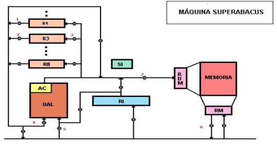

# Final 06-08-2024

## 1) Indique cuales son las microinstrucciones necesarias para ejecutar la instrucción SUMAR 3,20(4) en la máquina SuperAbacus, siendo 3 y 4 registros de uso general y 20 un offset en base 10. Graficar en el esquema de la máquina el flujo de apertura de compuertas usadas en la fase de ejecución de dicha instrucción.

```superabacus
AC <- (R4)
AC <- (AC) + 20
RDM <- (AC)
RM <- ((RDM))
AC <- (RM)
AC <- (R3) + (AC)
R3 <- (AC)
```

<div align="center">

</div>

## 2) Explique claramente qué es y cómo funciona el modo de direccionamiento doble registro indirecto (registro indirecto indexado) en la arquitectura ARM de 32 bits. Dar ejemplo en assembler.

* Registro indirecto con registro indexado: suma un registro base y un índice para calcular la dirección del dato

```ARM
_start:
    mov r4, #0

ciclo:
    ldr r1, [r2, r4]
    add r4, r4, #4

    b ciclo
```

## 3) Codificar un programa en assembler ARM de 32 bits que lea desde un archivo números enteros e imprima por la salida estándar la productoria de aquellos números que sean positivos

```ARM
    .data
archivo:
    .asciz "archivo.txt"
fHandler:
    .word 0

    .text
    .global _start

_start:
    ldr r0, =archivo
    mov r1, #0
    swi 0x66
    bcs fin
    ldr r1, =fHandler
    str r0, [r1]
    mov r4, #1

ciclo:
    ldr r0, =fHandler
    ldr r0, [r0]
    swi 0x6c
    bcs fin
    mov r2, r0
    cmp r2, #0
    bpl producto
    b ciclo

producto:
    mul r4, r4, r2
    b ciclo

fin:
    mov r0, #1
    mov r1, r4
    swi 0x6b
    swi 0x11
    .end
```

## 4) Indique como se puede clasificar el repertorio de instrucciones de una arquitectura de computadores de acuerdo al número de direcciones. Ejemplifique cada una.

* 0 direcciones (stack): `add`
* 1 direccion (acumulador): `add A`
* 2 direcciones (registro-memoria, registro-registro, memoria-memoria): `add r1, A`
* 3 direcciones (registrio, memoria): `add r1, r2, r3`

## 5) En un lenguaje ensamblador. ¿Cuál es la diferencia entre una instrucción, pseudoinstrucción (directiva) y macroinstrucción? ¿Qué hace el ensamblador al procesar cada una de ellas? De ejemplos de alguna de las arquitecturas vistas en clase.

* Instruccion: comandos de lenguaje ensamblador que representan operaciones. Traduce la instrucción a su código máquina correspondiente. `add, sub, mul`

* Pseudoinstrucción: comandos que no tienen una correspondencia directa en el hardware. Expande la pseudoinstrucción en una o más instrucciones reales. `.data nombre: .asciz "Hola"`

* Macroinstrucciones: secuencias de instrucciones que el programador define. Antes de traducir el código a máquina, expande la macro reemplazándola por su contenido. `%macro SUMAR 2 add %1, %2 %endmacro`

## 6) Explique claramente de qué se trata la técnica de procesamiento en paralelo multithreading en un procesador. Explique sintéticamente la diferencia entre un thread y un proceso y como es el cambio de contexto en un caso y otro.

* Multithreading: busca incrementar el uso del CPU intercambiando la ejecucion de threads cuando alguno esta frenado. 

* Thread: conjunto de registros y una pila, comparten un mismo address space.
* Proceso: contiene uno o mas threads, contiene un address space y un estado gestionado por el Sistema Operativo.
* Cambio: es “liviano” en comparación con los procesos, que requieren del Sistema Operativo
    - Fine-grained multithreading: se intercambia el uso del procesador entre threads luego de la ejecución de cada instrucción.
    - Coarse-grained multithreading: se intercambia el uso del procesador entre threads solo luego de algún evento significativo.

## 7) ¿Cuáles son las ventajas del nivel 6 de la arquitectura de discos RAID con respecto al nivel 5? En qué caso lo usaría? Grafique la distribución de la información en los discos en ambos niveles.

* Ventajas:
    - Tolerancia a fallos mayor.
    - Soportar rotura de hasta dos unidades.
* Desventajas:
    - Diseño complejo.
    - Mas costoso.

* Uso:
    - Seguridad de los datos es más importante que el rendimiento de escritura.

<div align="center">


</div>