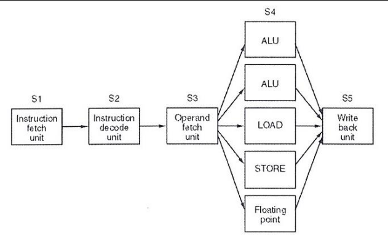
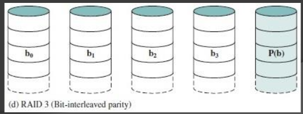

# Final 10-07-2024

## 1) Explique cuáles son los modos de direccionamiento, formatos de instrucción y tipos de datos presentes en la máquina SuperAbacus. De ejemplos de cada uno de ellos.

* Modos de direccionamiento:
    - Inmediato: `SUMAR r4, 100`
    - Registro Directo: `SUMAR r4, r5`
    - Registro Indirecto: `SUMAR r4, r5`
    - Base mas desplazamiento: `SUMAR r4, r5, 100`

* Formato de instruccion:
    - Codigo de operacion
    - 1er operando
    - 2do operando y Offset

* Tipos de datos:
    - Numericos: BPF s/c signo, BPFlotante IEEE 754, BCD
    - Caracteres: ASCII, EBCDIC

## 2) Explique claramente de qué se trata la técnica de procesamiento en paralelo Superscalar en un procesador. Grafique en forma esquemática cómo funciona dicha técnica y dé un ejemplo de algún procesador comercial que la incluya.

Superescalar: es una técnica de diseño de procesadores que permite ejecutar múltiples instrucciones por ciclo de reloj. Un procesador es el Intel Core.

<div align="center">

</div>

## 3) Explique claramente qué es y cómo funciona el modo de direccionamiento pre-indexado autoindexado (registro indirecto con pre-incremento) en la arquitectura ARM de 32 bits. De un ejemplo.

```arm
ldr r0, =vector
ldr r1, [r0, #4]
```

* Registro indirecto con pre-incremento: se le suma/resta el desplazamiento a la base antes de acceder a la memoria. Se accederia al "segundo" elemento.

## 4) Codificar un programa en assembler ARM de 32 bits que recorra un vector de enteros y los imprima por la salida estándar agregando la leyenda "PAR" a continuación de todos aquellos números que así lo sean.

```arm
    .data
vector:
	.word 1,2,6,5
long_vect:
	.word 4
espacio:
	.asciz " "
par:
	.asciz "PAR"
eol:
	.asciz "\n"

    .text
    .global _start

_start:
	ldr r2, =vector
	ldr r3, =long_vect
	ldr r3, [r3]
	mov r0, #1
	
ciclo:
	cmp r3, #0
	beq fin

	ldr r1, [r2]
	swi 0x6b
	
	and r4, r1, #1
	cmp r4, #1
	beq desplazar
	
	ldr r1, =espacio
	swi 0x69
	
	ldr r1, =par
	swi 0x69
		
desplazar:
	sub r3, #1
	add r2, #4
	
	ldr r1, =eol
	swi 0x69	
	
	b ciclo
	
fin:
    swi 0x11
    .end
```

## 5)  Explique claramente qué significan los términos big y little endian, en qué contexto se aplican y qué los diferencia. De ejemplos de arquitecturas en donde se use cada uno.

* Endianes: método aplicado para almacenar datos mayores a un byte en una computadora respecto a la dirección que se le asigna a cada uno de ellos en la memoria.

- Big-Endian: determina que el orden en la memoria coindice con el orden lógico del dato. “el dato final en la mayor dirección”. Arquitectura: IBM Mainframe.
- Little-Endian: es a la inversa, el dato inicial para la lógica se coloca en la mayor dirección y el dato final en la menor. “el dato final en la menor dirección”. Arquitectura: Intel.

## 6) Grafique el esquema general de un archivo de código objeto e identifique y explique cada una de sus secciones, indicando para que se usan.

- Identificacion: nombre del módulo, longitudes de las partes del módulo.
- Tabla de punto de entrada: lista de símbolos que pueden ser referenciados desde otros módulos.
- Tabla de referencias externas: lista de símbolos usados en el módulo, pero definidos fuera de él ysus referencias en el código.
- Código ensamblado y constantes.
- Diccionario de reubicabilidad: lista de direcciones a ser reubicadas.
- Fin de módulo.

<div align="center">

</div>

## 7) En la arquitectura de discos RAID de nivel 3: ¿qué ocurre con las peticiones de E/S mientras un disco queda inutilizable?

- Lecturas y escrituras se ralentizan.
- Reconstrucción mediante el disco de paridad.
- Las escrituras siguen funcionando, pero con sobrecarga.
- Riesgo de fallo total si otro disco falla.

<div align="center">

</div>