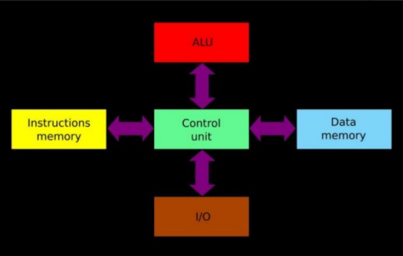
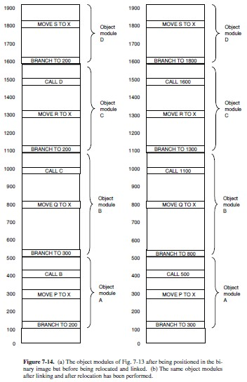

# Final 13-08-2024

## 1) Ventajas y desventajas de Harvard vs Von Neumann. Grafique ambas arquitecturas y justifique.

* Von Neumann:
    - Ventajas:
        1. Acceso simultáneo a instrucciones y datos, mejorando la velocidad.
        2. Mayor ancho de banda, ya que se pueden realizar lecturas/escrituras en paralelo.
        3.  Menor riesgo de cuellos de botella (bottleneck) en el bus de datos.
    - Desventajas:
        1. Mayor complejidad en el diseño del hardware.
        2. Costos más elevados debido a la duplicación de buses y memoria.
        3. Menos flexible para ciertas aplicaciones que requieren compartir memoria entre datos e instrucciones.

* Hardvard:
    - Ventajas:
        1. Diseño más simple y económico.
        2. Flexibilidad al utilizar una sola memoria para datos e instrucciones.
        3. Ideal para sistemas donde la simplicidad y el costo son factores clave.
    - Desventajas:
        1. Cuello de botella de Von Neumann: el bus único puede causar retrasos al alternar entre instrucciones y datos.
        2. Menor rendimiento en aplicaciones que requieren acceso rápido y paralelo a memoria.
        3. Mayor latencia en operaciones complejas debido a la dependencia de un solo bus de memoria.

<div align="center">


</div>

## 2) Explique claramente y ejemplifique al menos cuatro modos de direccionamiento presentes en la arquitectura ARM 32 bits.

- Registro indirecto: accede al dato usando la dirección almacenada en un registro
```c
add r2, r2, #4 // Incrementar r2 en 4
ldr r1, [r2] // Cargar en r1 el valor ubicado en la direccion almacenada en r2
```
- Registro indirecto post-incremento: accede al dato y luego incrementa automáticamente el registro base
```c
ldr r1, [r2], #4 // Carga en r1 el dato de [r2], luego incrementa r2 en 4
```
- Registro indirecto con registro indexado: suma un registro base y un índice para calcular la dirección del dato
```c
mov r4, #0 // Inicializa el indice en 0
ldr r1, [r2, r4] // Carga en r1 el valor en la direccion de r2 + r4
add r4, r4, #4 // Incrementa el indice en 4
```
- Registro indirecto con registro indexado escalado: suma un registro base y un índice escalado (multiplicado) para acceder a datos de mayor tamaño
```c
mov r4, #0 // Inicializo el indice en 0
ldr r1, [r2, r4, LSL #2] // Carga en r1 el valor en r2 + (r4 * 4)
add r4, r4, #1 // Incrementa el indice en 1
```

## 3) Codificar un programa en assembler ARM de 32 bits que recorra un vector de enteros y genere un archivo de salida con el resultado de aplicar la función AND en cada uno de los elementos del vector original contra una constante.

```ARM
    .data
vector:
    .word 3, 5, 7, 4
long_vector:
    .word 4
constante:
    .word 3
archivo:
    .asciz "archivo.txt"

    .text
    .global _start

_start:
    ldr r0, =archivo
    mov r1, #1
    swi 0x66

    ldr r2, =vector
    ldr r4, =long_vector
    ldr r4, [r4]
    ldr r5, =constante
    ldr r5, [r5]


ciclo:
    cmp r4, #0
    beq fin

    bl ORR

    sub r4, r4 ,#1
    add r2, r2, #4

    b ciclo

ORR:
    stmfd sp!, {r0, r2, lr}
    ldr r2, [r2]
    and r1, r2, r5
    swi 0x6b
    ldmfd sp!, {r0, r2, pc}

fin:
    swi 0x11
```

## 4) Indique al menos 4 características que identifiquen a los procesadores de la arquitectura ARM como procesadores de RISC. De ejemplos de esas características en dicha arquitectura.

* Solo acceso a memoria a través de LOAD/STORE: las operaciones aritmeticas y logicas se realizan contra registros.
```ARM
LDR r0, [r1]    // Carga el dato de la dirección en r1 hacia r0
STR r2, [r3]    // Almacena el contenido de r2 en la dirección de r3
```
* Muchos registros de procesador de uso general: ofrece un conjunto de amplios registros (r0 a r15) permitiendo almacenar mas datos temporalmente sin nesecidad de usar la memoria.
```ARM
MOV r4, #10     ; Mueve el valor 10 al registro r4
ADD r5, r4, #5  ; Suma 5 a r4 y almacena el resultado en r5
```
* Set de Instrucciones pequeño: deben ser pocas instrucciones simples que se ejecutan en un solo ciclo de reloj.
```ARM
ADD r1, r1, #1
SUB r1, r1, #1
MOV r1, r2
CMP r1, r2
```
* Pocos tipos de datos: permite trabajar principalmente con datos simples.
```ARM
    .data
numero:
    .word 4
texto:
    .asciz "Hola"
```

## 5) Explique cómo funciona el linking estático. Ejemplifique y grafique dicho funcionamiento. 

* Cada modulo objeto compilado es creado con referencias relativas al inicio del modulo.
* Se combinan todos los modulos en un unico load module reubicable.

* Generacion del load module:
    1. Tabla de todos los modulos objetos y longitudes.
    2. Asigna direccion base a cada modulo.
    3. Buscan las instrucciones que referencian a memoria y les suma una constante de reubicacion.
    4. Busca las instrucciones que referencien a eso y les inserta la direccion.

<div align="center">

</div>

## 6) ¿Qué es un “page fault” y cuando ocurre? ¿Quién lo gestiona?

* Page fault: cuando se quiere acceder a la direccion de memoria de una pagina no cargada. Este disparara una interrupcion por hardware atendida por el sistema operativo. Este levanta esa pagina desde la memoria secundaria.

## 7) Explique claramente cuáles son los eventos temporales presentes a la hora de almacenar o recuperar información en un disco magnético sectorizado. Indique cómo se calcula cada uno de ellos.

* Tiempo de seek: tiempo que tarda en mover la cabeza lectora/grabadora a la pista deseada.
* Tiempo de demora rotacional o latencia: tiempo de espera para llegar al sector deseado.
* Tiempo de acceso: tiempo necesario para llegar a la posicion donde escribir/leer `TA = TmpSeekProm + TmpDemProm`
* Tiempo de transferencia: tiempo necesario para transferir la informacion `TT = bytes/ velRot * bytesPista`