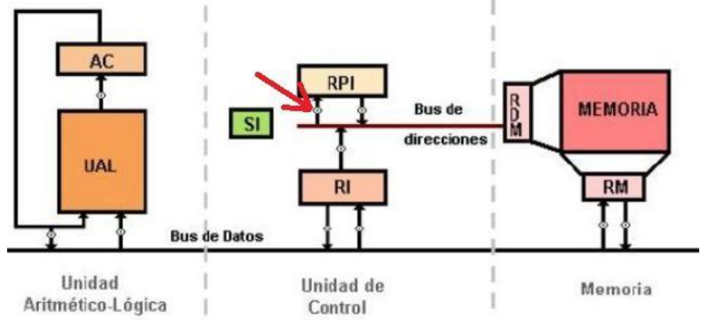

# Final 18-02-2025

## 1) Indique gráficamente en el esquema de la máquina Abacus cuál es la computadora que permite que se cumpla el principio de ruptura de secuencia de Von Neumann. Dé un ejemplo de una instrucción Abacus en donde se aplique este principio.

* Instruccion: `RPI <- (OP)`

<div align="center">

</div>

## 2) En la arquitectura ARM de 32 bits, ¿a qué se denomina ejecución condicional de una instrucción? Dé un ejemplo de su uso en assembler.

* Ejecucion condicional: la instrucción es ejecutada sólo si el estado actual del flag del código de condición del procesador satisface la condición especificada en los bits. Esta característica elimina la necesidad de utilizar muchas bifurcaciones.

`addeq r1, r2, r3` -> Va a hacer la suma solo si el flag de `zero` esta seteado en 1 (si los numeros en la comparacion anterior fueron iguales).

## 3) Codificar un programa en assembler ARM de 32 bits que recorra un vector de enteros y los imprima por la salida estándar agregando la leyenda “PAR” a continuación de todos aquellos números que así lo sean.

```arm
    .data
vector:
    .word 1,2,3,4
long_vect:
    .word 4
par:
    .asciz "PAR"
eol:
    .asciz "\n"
space:
    .asciz " "

    .text
    .global _start

_start:
    mov r0, #1
    ldr r2, =vector
    ldr r3, =long_vect
    ldr r3, [r3]

ciclo:
    cmp r3, #0
    beq fin

    ldr r1, [r2]
    swi 0x6b

    and r1, r1, #1
    cmp r1, #1
    beq desplazar

    ldr r1, =space
    swi 0x69

    ldr r1, =par
    swi 0x69

desplazar:
    ldr r1, =eol
    swi 0x69

    add r2, #4
    sub r3, #1

    b ciclo

fin:
    swi 0x11
    .end
```

## 4) ¿Qué limitaciones y qué ventajas plantea el modo de direccionamiento por registro? Dé un ejemplo de su uso en una arquitectura que conozca.

* Ventajas:
    - Alta velocidad: ya que esta usando registros y es mas rapido acceder a ellos.
    - Codigo mas eficiente: reduce la cantidad de instrucciones.
    - Menor consumo de energía: requiere menos ciclos de reloj y menor energia en comparacion con la memoria principal.

* Limitaciones:
    - Cantidad limitada de registros: los procesadores tienen una cantidad limitada de registros.
    - Necesidad de administración eficiente: es necesario saber gestionar bien los registros. Ya que podrias llegar a guardar en un registro que estes usando y perdes esa informacion.
    - Dificultad para operar con grandes volúmenes de datos: los registros estas hechos para manejar cierta cantidad de informacion.

```arm
mov r0, #10
mov r1, #5
add r2, r0, r1
```

## 5) Indique claramente cuáles son las acciones que realiza un ensamblador específicamente en la segunda pasada del proceso de ensamblado. ¿Qué información de la primera pasada permite realizar parte de dicho proceso? ¿Para qué usa y cómo usa dicha información?

* Acciones en la segunda pasada:
    1. Traduce los mnemonicos.
    2. Usa el codigo de operando para determinar el formato de la instruccion.
    3. Traduce cada nombre de operando.
    4. Traduce cada valor inmediato.
    5. Traduce las referencias a etiquetas.
    6. Setea otros bits necesarios.

* De la primera pasada se utilizan la tabla de simbolos y la longitud de instrucciones. Se usa para reemplazar las referencias simbolicas por direcciones finales, calcular desplazamientos en intrucciones de salto y traducir cada instruccion a codifgo maquina completo.

## 6) Explique claramente en qué consiste un ciclo de instrucción en un procesador, indique qué etapas contempla y qué tareas se realizan en cada una de ellas.

* Ciclo de instrucción: es el proceso que sigue un procesador para ejecutar una instrucción de un programa.

1. Búsqueda de instrucción: se obtiene la instrucción de memoria.
2. Decodificación de instrucción: se interpreta la instrucción y se identifican los operandos.
3. Búsqueda de operando: se recuperan los datos necesarios para la operación.
4. Ejecución de la instrucción: se realiza la operación correspondiente.
5. Almacenamiento del resultado: si la instrucción genera un resultado, se guarda en un registro o en memoria.
6. Procesamiento de interrupción: si ocurre una interrupción, el procesador la maneja antes de continuar con el siguiente ciclo de instrucción.

## 7) Identifique y explique cuáles son las principales desventajas del medio de almacenamiento en cinta. ¿Cuáles son sus aplicaciones actuales? ¿Qué ventajas comparativas tiene con respecto al resto de los medios de almacenamiento secundario?

* Cintas magenticas: usadas para hacer backup y de archivo de informacion.

* Ventajas:
    - Vida util.
    - Grandes tamaños de almacenamiento.
    - Bajo costo por byte (material mas barato).

* Desventajas:
    - Muy lento (acceso secuencial a la informacion).
    - Baja tasa de transferencia de datos.