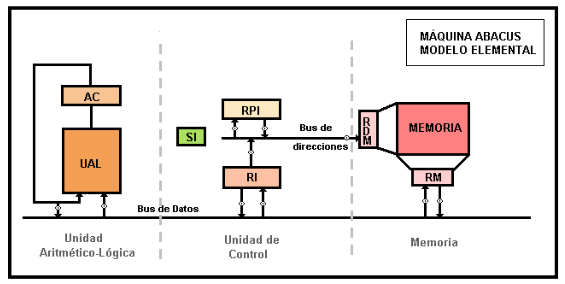
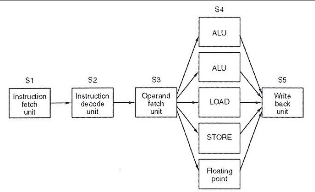
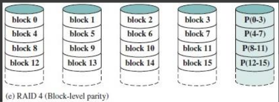
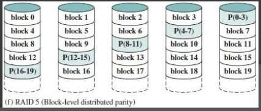

# Final 19-12-2024

## 1) Indique cuales son las microinstrucciones necesarias para las fases de búsqueda y ejecución de la instrucción SUMAR 300 en la máquina Abacus, siendo 300 la dirección de una celda en base 16. Graficar en el esquema de la máquina el flujo de apertura de compuertas usadas en ambas fases de dicha instrucción.

```abacus
Busqueda:
    RDM <- (RPI)
    RM <- ((RDM))
    RI <- RM
    RPI <- (RPI) + 1

Ejecucion:
    RDM <- (300)
    RM <- ((RDM))
    AC <- AC + (RM)
```

<div align="center">

</div>

## 2) Explique y ejemplifique cuatro modos de direccionamiento presentes en la arquitectura ARM 32 bits.  

- Registro indirecto: accede al dato usando la dirección almacenada en un registro `add r2, r2, #4 -> ldr r1, [r2]`
- Registro indirecto post-incremento: accede al dato y luego incrementa automáticamente el registro base `ldr r1, [r2], #4`
- Registro indirecto con registro indexado: suma un registro base y un índice para calcular la dirección del dato `mov r4, #0 -> ldr r1, [r2, r4] -> add r4, r4, #4`
- Registro indirecto con registro indexado escalado: suma un registro base y un índice escalado (multiplicado) para acceder a datos de mayor tamaño `mov r4, #0 -> ldr r1, [r2, r4, LSL #2] -> add r4, r4, #1`

## 3) Codificar un programa en assembler ARM de 32 bits que recorra un vector de enteros y genere un archivo de salida con el resultado de aplicar la función OR en cada uno de los elementos del vector original contra una constante.

```ARM
    .data
vector:
    .word 3, 5, 7, 4
long_vector:
    .word 4
constante:
    .word 3
archivo:
    .asciz "archivo.txt"

    .text
    .global _start

_start:
    ldr r0, =archivo
    mov r1, #1
    swi 0x66

    ldr r2, =vector
    ldr r4, =long_vector
    ldr r4, [r4]
    ldr r5, =constante
    ldr r5, [r5]


ciclo:
    cmp r4, #0
    beq fin

    bl ORR

    sub r4, r4 ,#1
    add r2, r2, #4

    b ciclo

ORR:
    stmfd sp!, {r0, r2, lr}
    ldr r2, [r2]
    orr r1, r2, r5
    swi 0x6b
    ldmfd sp!, {r0, r2, pc}

fin:
    swi 0x11
```

## 4) Indique como se puede clasificar el repertorio de instrucciones de una arquitectura de computadores de acuerdo con la ubicación de los operandos. Ejemplifique y/o grafique cada uno.

- Stack:
```c
push A
push B
Add
Pop C
```
- Acumulador:
```c
load A
add B
store C
```
- Registro-Memoria:
```c
load R1, A
add R3, R1, B
store R3, C
```
- Registro-Registro:
```c
load R1, A
load R2, B
add R3, R1, R2
store R3, C
```
- Memoria-Memoria:
```c
move C, A
add C, B
```

## 5) ¿Qué es el linking dinámico en tiempo de carga? ¿Qué ventajas tiene frente al estático?

Se difiere la linkedicion de alguno modulo hasta luego de la creacion del load module.

- Load time dynamic linking:
    1. Se levanta a memoria el load module.
    2. Cualquier referencia a un módulo externo hace que el loader busque ese módulo, lo cargue y cambie la referencia a una dirección relativa desde el inicio del load module.

* Ventajas:
    1. Facilita la actualización de versión del módulo externo porque no hay que recompilar.
    2. El sistema operativo puede cargar y compartir una unica version del modulo externo.
    3. Facilita la creacion de modulos de linkeo dinamico a los programadores.

## 6) Explique de qué se trata la técnica de procesamiento en paralelo Superscalar en un procesador. Grafique en forma esquemática cómo funciona dicha técnica y dé un ejemplo de algún procesador comercial que la incluya.

Superescalar: es una técnica de diseño de procesadores que permite ejecutar múltiples instrucciones por ciclo de reloj. Un procesador es el Intel Core.

<div align="center">

</div>

## 7) ¿Cuáles son las ventajas del nivel 5 de la arquitectura de discos RAID con respecto al nivel 4? En qué caso lo usaría? Grafique la distribución de la información en los discos en ambos niveles

* Ventaja: resuelve el cuello de botella por disco de paridad.

<div align="center">


</div>