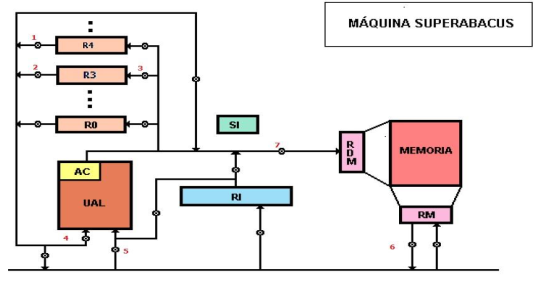
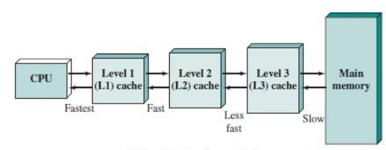

# Final 25-02-2025

## 1) Indique cuáles son las microinstrucciones necesarias para ejecutar la instrucción SUMAR 3,20(4) en la máquina SuperAbacus, siendo 3 y 4 registros de uso general y 20 un offset en base 10. Se pide además graficar en el esquema de la máquina el flujo de apertura de compuertas usadas en la fase de búsqueda y en la fase de ejecución de dicha instrucción.

```superabacus
AC <- (R4)
AC <- (AC) + 20
RDM <- (AC)
RM <- ((RDM))
AC <- (RM)
AC <- (AC) + (R3)
```

<div align="center">

</div>

## 2) Explique claramente qué es y cómo funciona el modo de direccionamiento post-indexado autoincrementado (registro indirecto con post-incremento) en la arquitectura ARM de 32 bits. Dé un ejemplo concreto con una instrucción.

```arm
ldr r0, =vector
ldr r1, [r0], #4
```

* Registro indirecto con post-incremento: es un modo de direccionamiento en la que se usa la dirección almacenada en un registro para acceder a un dato en memoria. Se realiza la operación de carga o almacenamiento. Después de la operación, el registro base se actualiza automáticamente sumándole un desplazamiento determinado.

## 3) Codificar un programa en assembler ARM de 32 bits que recorra un vector de enteros y genere e imprima por la salida estándar un nuevo vector formado por elementos que resultan de restar pares de elementos del vector original. Ej. vector original [1,2,6,5], vector nuevo [-1,1].

```arm
    .data
vector:
	.word 1,2,6,5
long_vect:
	.word 4
n_vect:
	.word 0,0,0,0
long_n_vect:
	.word 2
espacio:
	.asciz 0x20

    .text
    .global _start

_start:
	ldr r0, =vector
	ldr r1, =long_vect
	ldr r1, [r1]
	ldr r2, =n_vect
	ldr r3, =long_n_vect
	ldr r3, [r3]
	
ciclo:
	cmp r1, #0
	beq finCiclo
	
	ldr r4, [r0], #4
	sub r1, #1
	ldr r5, [r0]
	sub r1, #1
	
	sub r6, r4, r5
	str r6, [r2]
	
	add r0, #4
	add r2, #4

	b ciclo
finCiclo:
	mov r0, #1
	ldr r2, =n_vect

mostrar:
	cmp r3, #0
	beq fin
	
	ldr r1, [r2], #4
	swi 0x6b

	ldr r1, =espacio
	swi 0x69
	
	sub r3, #1

	b mostrar
fin:
    swi 0x11
    .end
```

## 4) Explique claramente qué significan los términos big y little endian, en qué contexto se aplican y qué los diferencia. Dé ejemplos de arquitecturas en donde se use cada uno.

* Endianes: método aplicado para almacenar datos mayores a un byte en una computadora respecto a la dirección que se le asigna a cada uno de ellos en la memoria.

- Big-Endian: determina que el orden en la memoria coindice con el orden lógico del dato. “el dato final en la mayor dirección”. Arquitectura: IBM Mainframe.
- Little-Endian: es a la inversa, el dato inicial para la lógica se coloca en la mayor dirección y el dato final en la menor. “el dato final en la menor dirección”. Arquitectura: Intel.

## 5) En un lenguaje ensamblador, ¿cuál es la diferencia entre una instrucción, pseudoinstrucción (directiva) y macroinstrucción? ¿Qué hace el ensamblador al procesar cada una de ellas? Dé ejemplos en alguna de las arquitecturas vistas en clase.

* Instruccion: comandos de lenguaje ensamblador que representan operaciones. Traduce la instrucción a su código máquina correspondiente. `add, sub, mul`

* Pseudoinstrucción: comandos que no tienen una correspondencia directa en el hardware. Expande la pseudoinstrucción en una o más instrucciones reales. `.data nombre: .asciz "Hola"`

* Macroinstrucciones: secuencias de instrucciones que el programador define. Antes de traducir el código a máquina, expande la macro reemplazándola por su contenido. `%macro SUMAR 2 add %1, %2 %endmacro`

## 6) En un sistema de memoria, ¿qué función cumple la memoria caché? ¿En qué principio se basa su efectividad? Grafique un ejemplo de arquitectura de caché de 3 niveles.

* Memoria cache: permite almacenar temporalmente informacion mejorando la performance del computador. En ella se almacenan temporalmente copias de la memoria principal. Siguen el principio de localidad:
	- Localidad temporal: si un dato fue accedido recientemente, es probable que sea nuevamente utilizado.
	- Localidad espacial: si se accede a un dato en una direccion de memoria es probable que el proximo dato que se pida sea el siguiente a esa direccion.

<div align="center">

</div>

## 7) Explique claramente cuáles son los eventos temporales presentes a la hora de almacenar o recuperar información en un disco magnético sectorizado. Indique cómo se calcula cada uno de ellos.

* Tiempo de seek: tiempo que tarda en mover la cabeza lectora/grabadora a la pista deseada.
* Tiempo de demora rotacional o latencia: tiempo de espera para llegar al sector deseado.
* Tiempo de acceso: tiempo necesario para llegar a la posicion donde escribir/leer `TA = TmpSeekProm + TmpDemProm`
* Tiempo de transferencia: tiempo necesario para transferir la informacion `TT = bytes/ velRot * bytesPista`

TmpTotal = TmpSeek + 0.5*R + b/RN

R = velocidad de rotacion en revoluciones por segundo.
b = bytes a transferir.
N = bytes por pista.