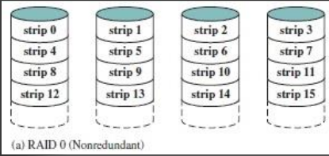
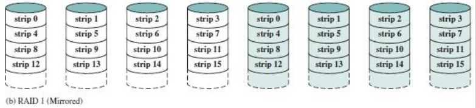

# Final 30-07-2024

## 1) Explique claramente cuáles son los pasos necesarios para actualizar el valor de la dirección de la próxima instrucción a ejecutarse en Abacus y SuperAbacus, en que se diferencian? especifique además las microinstrucciones necesarias en cada caso.

```abacus
RDM <- (RPI)
RM <- ((RDM))
RI <- (RM)
RPI <- (RPI) + 1
```

Se transfiere el contenido del RPI al RDM y envia a la memoria una orden de lectura. Se transfiere el contendo del RM al RI. Finalmente el RPI se prepara para la proxima instruccion.

```superabacus
RDM <- (R0)
RM <- ((RDM))
RI <- (RM)
AC <- (R0)
R0 <- (AC) + 1
```

Se transfiere el contenido del R0 al RDM y envia a la memoria una orden de lectura. Se transfiere el contendo del RM al RI. Finalmente se transfiere el contenido del R0 al Acumulador y se actualiza R0 sumandole uno al Acumulador.

* Diferencia: en superabacus no existe el registro de proxima instruccion (RDI), sino que se usa el registro R0 y se suma usando la UAL.

## 2) Explique claramente qué es y cómo funciona el barrel shifter en la arquitectura ARM de 32 bits. De ejemplos concretos con instrucciones assembler. 

* Barrel shifter: provee un mecanismo que lleva a cabo shifts como parte de otras instrucciones.
    - Shift a Izquierda (LSL): multiplica por potencias de 2.
    - Shift Lógico a Derecha (LSR): divide por potencia de 2.
    - Shift Aritmético a Derecha (ASR): divide por potencia de 2 (preserva bit de signo).

```ARM
LSL # 5 @ multiplica por 32
LSR # 5 @ divide por 32
ASR # 5 @ divide por 32
```

## 3) Codificar un programa en assembler ARM de 32 bits que recorra un vector de enteros y genere un nuevo vector formado por elementos que resultan de sumar pares de elementos del vector original. Ej. vector original {1,2,5,6}, vector nuevo {3,11}.

```ARM
    .data
vector:
    .word 3,4,5,6
long_vector:
    .word 4
nuevo_vector:
    .word 0,0,0,0

    .text
    .global _start

_start:
    ldr r0, =vector
    ldr r1, =long_vector
    ldr r1, [r1]
    ldr r2, =nuevo_vector

ciclo:
    ldr r4, [r0]
    add r0, #4
    sub r1, #1
    ldr r5, [r0]
    add r6, r4, r5
    str r6, [r2]
    add r0, #4
    add r2, #4
    sub r1, #1
    cmp r1, #0
    bne ciclo

fin:
    swi 0x11
    .end
```

## 4) Indique al menos 4 características que identifiquen a los procesadores de la arquitectura Intel como procesadores de CISC. De ejemplos de esas características en dicha arquitectura.

* Set de instrucciones amplio: `MUL EAX, EBX`
* Muchas instrucciones para trabajar con memoria: `ADD EAX, [EBX]`
* Instrucciones complejas (más de un ciclo de reloj): `REP MOVSB`
* Varios modos de direccionamiento: `MOV EAX, [EBX + 4*ECX]`

## 5) Explicar la segunda pasada del proceso de ensamblado.

1. Traduce los mnemonicos.
2. Usa el codigo de operando para determinar el formato de la instruccion.
3. Traduce cada nombre de operando.
4. Traduce cada valor inmediato.
5. Traduce las referencias a etiquetas.
6. Setea otros bits necesarios.

## 6) Explicar el procesamiento en paralelo por multiprocesadores.

* Multiples procesadores comparten memoria en comun.
* CPUs fuertemente acoplados.
* Diferentes implementaciones:
    - Single bus y memoria compartida (centralizada)
    - CPUs con memoria local y memoria compartida

## 7) ¿Cuáles son las ventajas del nivel 1 de la arquitectura de discos RAID respecto al nivel 0? Grafique la distribución de la información en los discos en ambos niveles.

* La lectura puede ser obtenida de cualquier disco que contenga la informacion.
* La escritura se hace de forma independiente.
* Alta disponibilidad de datos.
* Facil recuperacion de datos ante una falla.

<div align="center">


</div>